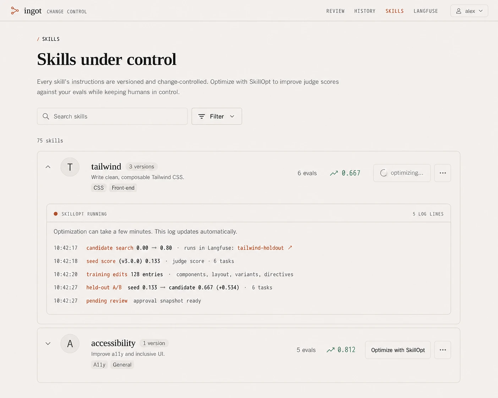

# Ingot

<p align="center">
  
</p>

**Evidence-gated change control for agent instructions.**

[](https://github.com/SlanchaAI/ingot/actions/workflows/ci.yml) [](LICENSE) [](Dockerfile) [](docker-compose.yml)

An agent's [skills](https://github.com/anthropics/skills) are instructions it follows. **Ingot** is a
local-first library and MCP server for individual developers who serve versioned skills, evaluate
optimizer-generated challengers, and require human promotion before those challengers replace live
instructions.

**[SkillOpt integration](https://github.com/microsoft/SkillOpt)** learns from real agent traces,
trains bounded instruction edits, compares them on held-out tasks, and produces an evidence-backed
proposal. SkillOpt can propose a change but cannot activate one.

[Quickstart](#quickstart) · [Tutorial](docs/tutorial.md) · [How it works](docs/how-it-works.md) ·
[Configuration](docs/configuration.md) · [Architecture](ARCHITECTURE.md) ·
[Production setup](PRODUCTION_SETUP.md) · [Contributing](CONTRIBUTING.md) ·
[Security](SECURITY.md) · [Apache 2.0 license](LICENSE)

## What Ingot controls

- **A revision names an exact skill.** Every file in a skill folder is hashed, so the revision on a
  trace, in a piece of evidence, and on disk are comparable.
- **Optimizer-generated changes are quarantined.** Challengers land in `runs/pending/` and cannot
  route traffic until a human promotes them.
- **Approval needs evidence.** A rewrite carries held-out champion-vs-challenger scores, per-case
  deltas, token cost, and a gate verdict; promotion re-checks the evidence still matches disk.
- **Promotion is staged and recoverable.** Ingot snapshots the active revision, stages the
  replacement, installs it with same-filesystem renames, and restores the prior directory if
  installation fails. Restore any snapshot from the UI or CLI.
- **Decisions produce a local audit trail.** Approvals, rejections, and rollbacks attempt to append
  metadata-only records after the transition. Audit-write failures are logged and do not roll back
  the decision; the local trail is not tamper-proof.

MCP serves the current contents of `skills/`. Direct edits, fetched skills, and copied or restored
folders bypass the proposal workflow and become active. Review them as trusted code before use.

## A recorded gated change

The current [tutorial](docs/tutorial.md) starts with stale Tailwind v3 instructions, trains a
challenger, and evaluates it on six held-out tasks. The recorded run improved the mean judge score
and reduced output tokens, but it also flagged a residual failure and an 80% body deletion:

```text
[ab] champion: mean judge score 0.133  [0.0, 0.2, 0.2, 0.0, 0.2, 0.2]
[ab] challenger: mean judge score 0.667  [0.8, 1.0, 0.9, 0.9, 0.4, 0.0]
[ab] output tokens/task: 1278 -> 808 (-470)
[ab] ⚠ acceptance criteria (minority, flagged for review): 'no_v3_tailwind_directives': 1/6 holdout answer(s) matched
[ab] ⚠ challenger drops 80% of the champion body, gated on only 6 held-out task(s), review the deletions carefully
[ab] pending approval written to /app/runs/pending/tailwind.json - review + promote at http://localhost:8080
```

The run stopped at a pending proposal; it did not change the live skill. The tutorial continues
through evidence review, deliberate promotion, and rollback.

## Deployment model

- **Batteries included.** `docker compose up` starts the router, the change-control UI, and a
  self-hosted [Langfuse](https://github.com/langfuse/langfuse) for traces and experiments. An
  included Compose override connects Cloud or another self-hosted Langfuse without starting the
  bundled stack.
- **Local or hosted inference.** Point it at Ollama or vLLM for local model traffic. Hosted calls
  use OpenRouter with zero-data-retention routing enforced on every request.
- **Local development by default.** Compose binds the public ports to localhost and password-gates
  the UI. The MCP endpoint has no built-in authentication, and Ingot is not a hardened multi-tenant
  service. Follow the production guide before sharing it beyond one trusted machine.
- **Easy.** A skill is a folder with a `SKILL.md`. Drop one in and it is live on the next request.

## Quickstart

Prerequisites:

- Git, a running Docker daemon, and Docker Compose 2.24.4 or newer.
- Free localhost ports `8000`, `8080`, and `3100`.
- An OpenRouter API key, or a reachable OpenAI-compatible Ollama or vLLM endpoint.

`scripts/fetch_skills.sh` copies unpinned third-party skills into the live `skills/` directory. For
this PDF demo, fetch only Anthropic's document skills. Review their instructions and per-skill
licenses in [Skill sources](docs/skill-sources.md) before running the fetch; add other sources after
the first run.

```bash
git clone https://github.com/SlanchaAI/ingot.git && cd ingot
cp .env.example .env               # set API_KEY, or point BASE_URL at Ollama or vLLM
scripts/fetch_skills.sh anthropics # fetch the document skills used by this demo
docker compose up -d --build       # router (:8000), UI (:8080), Langfuse (:3100)
docker compose ps
docker compose run --rm agent "How do I merge several PDFs into one and add page numbers?"
```

A successful run names the route and the exact skill revision loaded before the answer. This is an
excerpt from the recorded tutorial run; scores, hashes, token counts, and model output vary:

```text
COMPATIBLE ROUTE (MCP route_and_load):
    0.74  pdf: Use this skill whenever the user wants to do anything with PDF files...

LOADED SKILLS (MCP route_and_load): ['pdf@83a75cf1f9b5…']
TOKENS: 23233 in / 698 out

RESULT:
... (working pypdf + reportlab code, following the loaded skill)
```

The `pdf@…` line is the first-value signal: Ingot routed the task and supplied a content-addressed
skill revision. The full trace appears in Langfuse at `localhost:3100`.

The change-control UI at `localhost:8080` asks for a login; the compose default is **`admin` /
`ingot`**. Change `AUTH_PASSWORD` in `.env` before sharing it on your LAN. To run without a login,
set `AUTH_MODE=open` explicitly. See [Privacy & security](docs/security.md#network-exposure).

`docker compose up` brings up a self-hosted Langfuse (traces + experiment UI) alongside the router
and UI; trace mining reads from it and has no local fallback, so it fails loudly if no
Langfuse-compatible backend is reachable. To send traces to your own Langfuse without starting the
bundled containers, set `LANGFUSE_*` and use `docker-compose.external-langfuse.yml` as documented in
[Configuration](docs/configuration.md#using-your-own-langfuse-project). Backend, model, and gate
settings live in [Configuration](docs/configuration.md).

Then walk through the full loop, from mining a stale Tailwind skill through promotion, in the
[**Tutorial**](docs/tutorial.md).

### Optimize and review in the UI

Click a skill's name or description to open its read-only detail view. The version selector lets
you explore the active revision, a pending challenger, and rollback snapshots. The file selector
shows `SKILL.md` plus any bundled resources for the selected version. Browsing does not change the
revision being served. Each skill row shows the total number of active, pending, and snapshotted
versions available in that explorer.

Find a skill with an eval set and click **Optimize with SkillOpt**. The UI immediately explains
that optimization can take a few minutes, disables the button, and opens the live generation log
directly beneath that skill. The log updates automatically, so progress stays attached to the
change you started instead of appearing in a page-level activity panel.



When the run finishes, its challenger remains quarantined. Review the risk summary, unified or
side-by-side diff, held-out task table, model names, and token changes before approving or
rejecting it. Clicking **Approve & promote** in the comparison panel makes the final decision.

For a hardened open-source Langfuse deployment with agents on other LAN machines, follow
[Production setup](PRODUCTION_SETUP.md).

### Connect Claude Code or Codex

You can use Ingot with your existing coding agent instead of the bundled demo agent. Start the
stack, then run the setup script for your agent. The Codex connector requires Codex 0.128 or newer,
Node.js 22 or newer, and Python 3. The Claude Code connector requires `uv` (recommended), or
Python 3.10 or newer with `pip` and the Langfuse 4.x SDK:

```bash
# macOS, install only the dependencies your selected agent needs
brew install node@22       # Codex
brew install uv            # Claude Code
brew install python@3.12   # Codex when python3 is missing, or Claude's fallback runtime

docker compose up -d
./scripts/claude_setup.sh
# or
./scripts/codex_setup.sh
```

Both scripts are safe to run again. Use `--doctor` to inspect versions, installed connectors,
configuration, and Langfuse reachability without changing anything. Use `--repair` to replace a
mismatched MCP registration and reinstall managed dependencies or plugins:

```bash
./scripts/claude_setup.sh --doctor
./scripts/claude_setup.sh --repair
./scripts/codex_setup.sh --doctor
./scripts/codex_setup.sh --repair
```

Each script adds `http://localhost:8000/mcp` as the user-level `ingot` MCP server and installs the
official Langfuse observability connector. Claude Code prompts for the Langfuse URL and project keys
after restart only when configuration is incomplete. The setup script supplies `LANGFUSE_*` values
or the bundled local defaults during installation. The Codex script writes a private
`~/.codex/langfuse.json`; it defaults to the bundled Langfuse at `http://localhost:3100` with the
local demo project keys.

For Langfuse Cloud or another self-hosted project, provide its values when running the Codex setup:

```bash
LANGFUSE_BASE_URL=https://cloud.langfuse.com \
LANGFUSE_PUBLIC_KEY=pk-lf-... \
LANGFUSE_SECRET_KEY=sk-lf-... \
./scripts/codex_setup.sh
```

Set `INGOT_MCP_URL` if the MCP server is not on localhost. The connectors record prompts, responses,
reasoning summaries, and tool inputs and outputs, including Ingot MCP calls, so do not enable them
for sessions whose contents must not be stored in Langfuse. Their trace-root shapes are accepted by
`optimize-mine`; untagged turns are attributed to skills by task similarity. See
[Bring your own agent](docs/mcp-integration.md) for the trace contract and routing behavior.
Tell the agent to call `ingot.route_and_load` once at the start of each request and follow the
returned `skill_body`; connecting the MCP server makes the tool available but does not force its use.
Add this as a persistent `CLAUDE.md` or `AGENTS.md` rule, not just a one-time chat prompt. See
[Make skill loading part of the agent instructions](docs/mcp-integration.md#make-skill-loading-part-of-the-agent-instructions).
For an agent on another machine, see [Agent on another LAN machine](docs/mcp-integration.md#agent-on-another-lan-machine).
Verify that the services are reachable before starting the agent:

```bash
curl http://localhost:8000/mcp                 # an HTTP error response still proves MCP is listening
curl http://localhost:3100/api/public/health  # should return a healthy Langfuse response
```

## How it works

Ingot does three things around your skill library:

- **Serve.** An MCP server routes each task to the current live revision of the right skill (embedding
  routing on CPU, no GPU) and supplies the current content-addressed instructions.
- **Govern.** Optimizer-generated challengers are quarantined, carry held-out evidence, and need
  human promotion. Promotion is snapshotted and recoverable.
- **Improve.** SkillOpt integration mines real traces for failing skills, trains bounded instruction
  edits with its reflective optimizer, and A/Bs the result on held-out tasks, leaving a reviewable
  proposal that only a human can activate.

The component map is in [docs/how-it-works.md](docs/how-it-works.md); deeper design in
[ARCHITECTURE.md](ARCHITECTURE.md).

## Documentation

| Doc | Contents |
|-----|----------|
| [Tutorial](docs/tutorial.md) | The full loop end to end: route, mine, optimize, review, promote, roll back |
| [How it works](docs/how-it-works.md) | Component map (MCP server, agent, optimizer, UI) |
| [Configuration](docs/configuration.md) | Env reference, SkillOpt optimization, cross-model compatibility, eval task sets, Langfuse |
| [The evidence gate](docs/evidence-gate.md) | The anti reward-hacking checks a reviewer relies on |
| [Privacy & security](docs/security.md) | Zero-data-retention, network exposure, threat model |
| [Sign in with Google (SSO)](docs/sso.md) | Domain-restricted login and roles for a shared deployment |
| [Bring your own agent](docs/mcp-integration.md) | Use the MCP server from your own harness; tracing |
| [Skill sources](docs/skill-sources.md) | Where `scripts/fetch_skills.sh` gets skills, and their licenses |
| [Production setup](PRODUCTION_SETUP.md) | Harden Langfuse and enroll remote Claude Code or Codex agents |

## License

Apache-2.0, see [LICENSE](LICENSE).

## Project status and support

Ingot supports local development for one trusted operator. Only the latest `master` revision
receives security fixes. Report bugs through [GitHub Issues](https://github.com/SlanchaAI/ingot/issues),
ask usage questions on [Discord](https://discord.gg/TtYVvwHJRQ), and report vulnerabilities through
the private process in [SECURITY.md](SECURITY.md).
