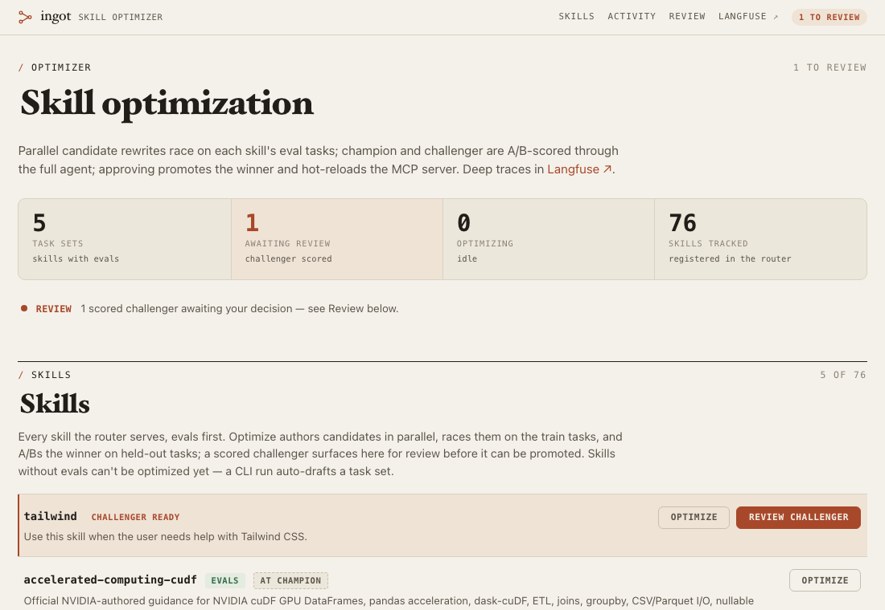
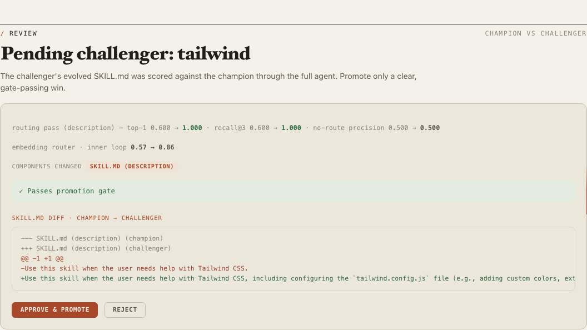
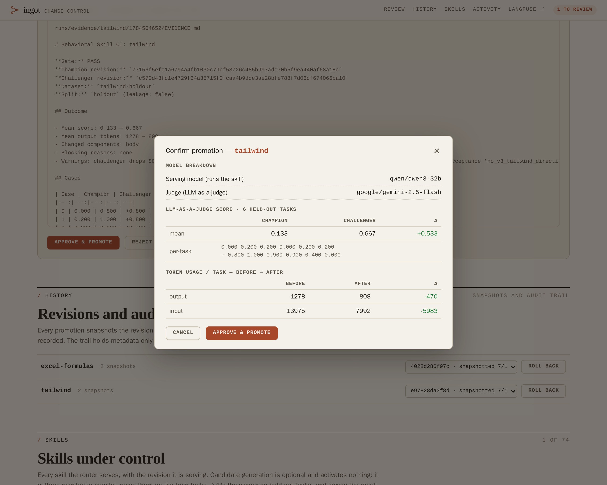

# Ingot

**Evidence-gated change control for agent instructions.**

[](https://github.com/SlanchaAI/ingot/actions/workflows/ci.yml) [](LICENSE) [](Dockerfile) [](docker-compose.yml)

An agent's [skills](https://github.com/anthropics/skills) are instructions it will follow. **Ingot**
is a local-first library that treats them as what they are: versioned state that needs a review
process. Every skill folder is content-addressed. Every proposed change to one is quarantined until
a human reads the evidence and approves it. Promotion is atomic, snapshots what it replaced, and is
recorded.

An **MCP server** serves the approved revision of the right skill for each task, which is what lets
a cheap or local model reuse methods that would otherwise need a frontier model.

What the system actually guarantees:

- **A revision names an exact skill.** `skill_revision` hashes every file in the folder, so the
  revision on a trace, in a piece of evidence, and on disk are comparable.
- **Changes are quarantined.** Agent-authored skills (`create_skill`) and generated rewrites land
  in `runs/pending/` and cannot route traffic. One review slot per skill; displaced candidates are
  archived, not dropped.
- **Approval needs evidence.** A rewrite carries a bundle in `runs/evidence/<skill>/<ts>/` as
  `evidence.json` and `EVIDENCE.md`, readable from the review card. A body-pass bundle holds
  held-out champion-vs-challenger scores, per-case deltas, the first behavioral divergence, token
  cost, and the gate verdict; a description-pass bundle holds the router metrics that gated it.
  Promotion re-checks that the evidence still matches the on-disk champion; a challenger that wins
  the mean but fails the gate is recorded and refused.
- **Promotion is atomic and reversible.** The displaced revision is snapshotted into
  `runs/revisions/` and the directory is swapped by rename; a failed swap restores the original.
  Restore any snapshot from the UI's History section or the CLI.
- **Decisions are audited.** Approvals and rollbacks append metadata-only records (action, skill,
  revision, actor, timestamp) to `runs/approval-audit.jsonl`. Never skill text, never credentials.
  The append is best effort: the record is written after the change is already committed on disk,
  so a failed write is logged as a warning and leaves the promotion or rollback in place rather
  than undoing it. Treat the trail as a local operator log, not a tamper-evident ledger.

Built for individual users first:

- **Lite.** `docker compose up` starts just the router and the change-control UI. The tracing stack
  is an optional upgrade (`--profile langfuse`), not a requirement.
- **Local.** Point it at Ollama or vLLM and it runs with no API key; skills, traces, and evals
  never leave your machine.
- **Secure.** Hosted calls default to OpenRouter with zero-data-retention provider routing
  enforced on every request, and no service is reachable off your machine.
- **Easy.** A skill is a folder with a `SKILL.md`. Drop one in and it is live on the next request.

Where do changes come from? Mostly from you and your agents. Ingot also ships an **optional**
candidate generator: it mines real traces for failing skills, drafts rewrites, and measures them on
held-out tasks. It is a background experiment that produces proposals, never activations. In the
[recorded walkthrough below](#5-optional-generate-a-candidate-in-the-background), a stale skill's
held-out mean judge score rose from 0.133 to 0.667 while output tokens fell from 1,278 to 808, for
about $0.06, and a human still had to approve it.

[Quickstart](#quickstart-lite-mode) · [Full tutorial](#tutorial) ·
[Architecture](ARCHITECTURE.md) · [Contributing](CONTRIBUTING.md) · [Security](SECURITY.md) ·
[MIT license](LICENSE)

## Quickstart (lite mode)

```bash
git clone https://github.com/SlanchaAI/ingot.git && cd ingot
cp .env.example .env               # add an OpenRouter key, or point BASE_URL at Ollama (no key)
scripts/fetch_skills.sh all        # fetch ~70 real skills into ./skills (see Skill sources)
docker compose up                  # lite by default: skill router (localhost:8000) + change-control
                                   # UI (localhost:8080) + one demo agent run
docker compose run --rm agent "How do I merge several PDFs into one and add page numbers?"
```

The lite stack uses ports `8000` and `8080` and the fixed Compose project name `ingot`. Stop an
existing Ingot stack before starting a second checkout on the same host.

The change-control UI at `localhost:8080` asks for a login — the compose default is **`admin` /
`ingot`**. Change `AUTH_PASSWORD` in `.env` before sharing it on your LAN (or set `AUTH_PASSWORD=`
empty to run it open); see [Network exposure](#network-exposure).

No hosted key? The final command still verifies the router: `suggest_skills` returns the `pdf`
skill at 0.74, then the agent explains how to configure a model for the full answer.

Every agent run appends to a local trace store (`runs/traces.jsonl`); `optimize-mine` and the
held-out A/B read it whenever Langfuse is unreachable, so the whole loop works in lite mode. You
lose only the trace browser and experiment UI. Want those?

Local trace records use schema version 1. Original unversioned records remain readable. The store
defaults to secret-pattern redaction, mode `0600`, a mode `0700` parent directory, 10 MiB rotation,
and three backups. Configure it in `.env`:

```bash
LOCAL_TRACE_ENABLED=false          # complete local trace opt-out
LOCAL_TRACE_REDACT=true            # redact common token, key, password, and secret assignments
LOCAL_TRACE_MAX_AGE_DAYS=30        # prune older records on append; 0 disables age retention
LOCAL_TRACE_MAX_BYTES=10485760     # rotate before the next append after this size
LOCAL_TRACE_BACKUPS=3              # retained rotated files; 0 truncates on rotation
TRACES_FILE=/app/runs/traces.jsonl # optional alternate path
```

Redaction is defense in depth, not a data-loss-prevention system. Avoid placing secrets in tasks,
review trace access, and delete old backups according to your retention requirements. Langfuse has
separate retention controls.

```bash
docker compose --profile langfuse up   # adds the self-hosted Langfuse stack (localhost:3100)
```

Everything upgrades in place. The tutorial below runs in lite mode; nothing in it needs the
Langfuse stack.

## Privacy first

Three properties, all defaults, none optional:

- **Zero data retention LLM calls.** The default provider is **OpenRouter** with
  [Zero Data Retention (ZDR)](https://openrouter.ai/docs/features/zdr) enforced on every request.
  Each call (agent runs, candidate rollouts and reflection, the judge, task drafting) carries a
  hardcoded provider preference:

  ```json
  {"provider": {"zdr": true, "data_collection": "deny"}}
  ```

  OpenRouter then routes only to ZDR endpoints operated by providers that do not collect user
  data. A model with no qualifying endpoint fails loudly rather than falling back to one that
  retains prompts. Provider-direct endpoints work too: Fireworks AI, for example, is
  [zero-data-retention by default](https://docs.fireworks.ai/guides/security_compliance/data_handling)
  for open models on serverless, under its own retention policy.
- **Self-hosted tracing.** Langfuse (with its Postgres, ClickHouse, and MinIO) runs inside the
  compose stack. Traces, skill contents, and eval outputs never leave your machine.
- **Localhost only.** No service is reachable off the machine (see
  [Network exposure](#network-exposure)).

The only data that leaves your machine is the LLM traffic itself. `BASE_URL` + `API_KEY` point
everything at any OpenAI-compatible provider (`MODEL_BASE_URL`/`MODEL_API_KEY` override just the
serving role):

```bash
# the default (.env.example): OpenRouter, ZDR-only provider routing enforced in code
BASE_URL=https://openrouter.ai/api/v1
API_KEY=sk-or-...

# provider-direct alternative: Fireworks AI (ZDR by default for open models on serverless)
BASE_URL=https://api.fireworks.ai/inference/v1
API_KEY=fw_...
AGENT_MODEL=accounts/fireworks/models/qwen3p7-plus
GEPA_MODEL=accounts/fireworks/models/glm-5p2
JUDGE_MODEL=accounts/fireworks/models/deepseek-v4-pro

# fully local (no key needed at all): everything on Ollama / vLLM
BASE_URL=http://172.17.0.1:11434/v1  AGENT_MODEL=qwen3:32b  GEPA_MODEL=qwen3:32b  JUDGE_MODEL=llama3.3:70b
```

No API key is required when nothing points at a hosted endpoint. From inside the compose
containers, "localhost" is the container itself; use your host's LAN IP (or `172.17.0.1` on Linux).

## Tutorial

The tutorial takes one skill through the whole lifecycle: write the quick first-draft skill you'd
actually jot down, watch it under-deliver on real traffic, diagnose it, generate a candidate change,
then review, promote, and (if you want it back) roll back. Every command and number below comes
from a real run.

### 1. Set up and start the stack

```bash
git clone https://github.com/SlanchaAI/ingot.git && cd ingot
cp .env.example .env               # put your OpenRouter key in it (https://openrouter.ai/settings/keys)
scripts/fetch_skills.sh all        # fetch ~70 real skills into ./skills (see Skill sources)
docker compose up --build
```

This brings up the MCP server (`localhost:8000`) and the change-control UI (`localhost:8080`), then
runs the agent once on a demo task. The UI lists every skill the router serves, each with its
content-hash revision and a load count (how often it has actually been served), and surfaces
anything awaiting review:



No skills are committed to this repo. `fetch_skills.sh` clones each source, copies its skills in,
and deletes the clone, so everything stays under its own upstream license. Without an API key
everything still starts and the router still prints suggestions; the agent and the candidate
generator tell you what to set and exit cleanly.

### 2. The agent routes to a skill and uses it

```bash
docker compose run --rm agent "How do I merge several PDFs into one and add page numbers?"
```

```
COMPATIBLE ROUTE (MCP route_and_load):
    0.74  pdf: Use this skill whenever the user wants to do anything with PDF files...

SERVING MODEL: accounts/fireworks/models/qwen3p7-plus

LOADED SKILLS (MCP route_and_load): ['pdf@83a75cf1f9b5…']
TOKENS: 23233 in / 698 out

RESULT:
... (working pypdf + reportlab code, following the loaded skill)
```

The agent asked the canonical router (`route_and_load`), received one compatible skill body, and
followed it. The `@…` suffix is the skill's content-hash revision, which also lands on the trace as
a tag. Unconstrained suggestions never control the serving model or loaded instructions.
A routed task runs on the cheap `AGENT_MODEL` because the skill carries the method; only truly
novel tasks escalate to `STRONG_MODEL` (step 10). Steps 2 to 4 were recorded on Fireworks model
IDs and steps 5 to 8 on the OpenRouter defaults (`qwen/qwen3-32b` serving); the `SERVING MODEL`
line always shows whatever `AGENT_MODEL` you configure. The run's full trace just landed in
`runs/traces.jsonl`; that local store is what the miner reads in step 4.

### 3. Write a first-draft skill and watch it under-deliver

A skill is a directory with a `SKILL.md`: YAML frontmatter whose `description` is the routing key,
and a body the agent loads. The tutorial skill is **Tailwind CSS**, a library with a hard version
break (v4 moved configuration from `tailwind.config.js` into CSS), so the quick notes you'd jot
down are not just thin, they're stale:

```bash
mkdir -p skills/tailwind
cat > skills/tailwind/SKILL.md <<'EOF'
---
name: tailwind
description: Use this skill when the user needs help with Tailwind CSS.
---

# Tailwind CSS

1. Install with npm and run the init command to create tailwind.config.js.
2. Add your source files to the `content` array so classes are picked up.
3. Put custom colors, fonts, and breakpoints under `theme.extend`.
4. Start your CSS with `@tailwind base;` `@tailwind components;` `@tailwind utilities;`.
EOF
```

Every line of that body is the v3 way, wrong since v4. `skills/` is bind-mounted and the server
hot-reloads on change, so the skill is live immediately. Send it some realistic traffic:

```bash
for t in "Add a brand color to my Tailwind setup so bg-brand works." \
         "Set up Tailwind in a fresh Vite app." \
         "Why aren't the classes from my component library in node_modules getting styled?"; do
  docker compose run --rm agent "$t"
done
```

```
== Add a brand color to my Tailwind setup so bg-brand works.
   0.723  tailwind - Use this skill when the user needs help with Tailwind CSS.
LOADED SKILLS (MCP get_skill): (none)
== Set up Tailwind in a fresh Vite app.
   0.709  tailwind - Use this skill when the user needs help with Tailwind CSS.
LOADED SKILLS (MCP get_skill): ['tailwind@77156f5efe1a…']
== Why aren't the classes from my component library in node_modules getting styled?
   0.621  web-artifacts-builder (related - compose/extend) - Suite of tools for creating elaborate…
LOADED SKILLS (MCP get_skill): (none)
```

Three requests, three different failures. The requests that say "Tailwind" route fine, and the
second one actually loaded the skill, serving the stale v3 notes to live traffic. The third
request never says "Tailwind" and misrouted to `web-artifacts-builder`, which mentions Tailwind in
its description. All three failures are now sitting in your traces.

### 4. Mine what's failing (from real traces)

`optimize-mine` re-judges your logged traffic with a multi-dimensional LLM judge (the
[SkillForge paper's](https://arxiv.org/abs/2604.08618) "Failure Analyzer" applied to your own
traces). A trace counts toward a skill if it's tagged with it or ranks it in the embedding top-5,
so misrouted traffic still counts toward the skill that should have served it:

```bash
docker compose run --rm optimize-mine tailwind
```

```
[mine] 39/50 recent traces relevant to 'tailwind'
[mine] analyzed 39 real traces · mean judge score 0.50 · 20 bad cases (score < 0.5)
[mine] failure dimensions, most common first:
    correctness             20/39  █████
    completeness            20/39  █████
    instruction_following   20/39  █████
    efficiency              16/39  ████
[mine] 6 weakest tasks mined as eval candidates → optimize on these next.
```

The diagnosis is version drift: answers built on `tailwind.config.js` and `@tailwind` directives,
the v3 world the stub teaches. The weakest mined tasks are surfaced as eval candidates for
`optimize/tasks/<skill>.yaml`; see [Writing eval task sets](#writing-eval-task-sets).

Reference-free judging of live traffic is noisy. Treat mined dimensions as a diagnosis to
investigate, not a verdict; the evidence gate runs on rubrics.

### 5. (Optional) Generate a candidate in the background

At this point you know what is wrong and could fix the body by hand: edit `SKILL.md`, and the router
serves the new revision on the next request. This step does it the other way, with the optional
candidate generator, so the change arrives with measured evidence attached.

Write an eval task set for the skill (`optimize/tasks/tailwind.yaml`) with train and holdout tasks
whose rubrics carry the v4 ground truth (the teacher can also auto-draft one on a skill's first CLI
run). Then run it headless, which is how it is meant to run:

```bash
docker compose run --rm optimize tailwind
```

The generator authors several candidate bodies in parallel, races them on the train tasks, and A/Bs
the winner against the champion through the full agent on the held-out tasks (about two minutes, a
few cents). The UI's **Generate candidate** button starts the same run. Our run:

```
[skillopt] seed: hard 0.000 soft 0.000 gate 0.000 (mixed) on 6 train tasks; 2 epoch(s), minibatch 3, ≤3 edits/step
[skillopt] step 1: accept_new_best (1 edit(s)) — gate 0.750
[skillopt] step 2: accept_new_best (3 edit(s)) — gate 0.767
[skillopt] step 3: accept_new_best (2 edit(s)) — gate 0.808
[skillopt] step 4: accept_new_best (1 edit(s)) — gate 0.817
[skillopt] winner after 4 step(s): gate 0.817 (seed 0.000)
[ab] champion: mean judge score 0.133  [0.0, 0.2, 0.2, 0.0, 0.2, 0.2]
[ab] challenger: mean judge score 0.667  [0.8, 1.0, 0.9, 0.9, 0.4, 0.0]
[ab] champion 0.133 vs challenger 0.667 -> CHALLENGER WINS
[ab] output tokens/task: 1278 -> 808 (-470)
[ab] ⚠ acceptance criteria (minority — flagged for review): 'no_v3_tailwind_directives': 1/6 holdout answer(s) matched
[ab] ⚠ challenger drops 80% of the champion body, gated on only 6 held-out task(s) — review the deletions carefully
  estimated cost: $0.06 (OpenRouter list prices)
[ab] pending approval written to /app/runs/pending/tailwind.json - review + promote at http://localhost:8080
```

Read what happened. Every line of the stub body is the v3 way, so it scored 0.000 in bare rollouts.
SkillOpt reflected on the failing minibatches, and because the judge feedback flagged the loaded
guidance as *wrong* (not just incomplete), it proposed bounded **delete/replace** edits that stripped
the stale v3 lines rather than appending beside them — that is the 80% body drop the review gate
flags. Across four accepted steps the body became clean v4. On the held-out A/B through the real
agent, the stub champion scored 0.133 — a small serving model follows the loaded v3 advice straight
into wrong answers — while the challenger scored **0.667 with fewer tokens** (808 vs 1278 out/task).
The acceptance gate caught a residual: on 1 of 6 holdout tasks the weak model still emitted a v3
directive despite the clean body — a minority, so the graded gate flags it as a ⚠ warning rather
than blocking. The result is **promotable-but-flagged**: a human weighs the large deletion and the
residual slip in the comparison panel before approving, and only then does `skills/tailwind` change.

Note what the run did *not* do: it did not touch `skills/tailwind/`. It wrote a quarantined record
and an evidence bundle, and stopped.

The size of the win tracks the serving model: **body-pass wins concentrate where the body carries
knowledge the serving model doesn't have** (weak or older models, internal tools, your
conventions, post-cutoff dependencies). On a frontier serving model the same experiment ends the
other way: in an earlier recorded run the champion scored a perfect 1.000 (the strong model
recognized the v3 stub as stale and answered v4 from its own knowledge) and the gate refused the
rewrite. The gate's refusals are what make the wins trustworthy: in a companion run against the
NVIDIA-authored `accelerated-computing-cudf` skill, a challenger that dropped half the champion
body and regressed a held-out task was blocked, 0.980 vs 0.800.

Generation is greedy: one component per pass, each scored by its own role's metric:

| pass | command | candidate-search objective | cost |
|------|---------|---------------------------|------|
| body (default) | `optimize tailwind`, or the UI's **Generate candidate** button | LLM judge on train tasks; full-agent A/B for the evidence | ~$0.05 |
| description | `optimize tailwind --description` | the routing suite, scored by the real embedding router; no LLM rollouts | ~$0.01, a couple of minutes |

The split exists because a quality judge can't measure routing and a router can't measure quality.
There is no scripts pass: bundled files are opt-in text components
(`OPTIMIZE_COMPONENTS=body,file:<path>`) that are diffed for review and never executed. The body
pass's rollouts serve each candidate under the exact contract the A/B serves, so the search can't
optimize against different instructions than the A/B measures. `GEPA_ROLLOUTS=agent` runs every
rollout through the full agent scaffold instead (a legacy variable name: it predates the removal of
the GEPA body loop and now selects the SkillOpt candidate search's rollout mode).

### 6. Review, promote, roll back

Back at **http://localhost:8080**, the header pill flips to **1 to review**, the Review section
leads with the evidence, and the `tailwind` row shows a `change awaiting review` chip. The card
carries the champion-vs-challenger judge scores, the before/after token shift, the gate verdict and
its warnings, the recorded evidence bundle, and the component diff — here the red lines are the v3
guidance SkillOpt removed and the green lines are the v4 body it wrote:



**Approve** doesn't promote in one click: it opens a comparison panel with the model breakdown,
the before/after token usage, and the per-task judge scores, and a final **Approve & promote** that
reveals a separate **Confirm** — so a promotion is deliberate.



**Approve & promote** verifies the evidence still matches the on-disk champion, snapshots the prior
revision into `runs/revisions/tailwind/<revision>/`, swaps the challenger into `skills/tailwind/` by
rename, and appends an `approve` record to `runs/approval-audit.jsonl`. The MCP server picks up the
revision change with no restart. **Reject** discards the candidate.

That snapshot is the undo. It appears in the UI's **History** section, and restoring it is one
click, or one command:

```bash
# --entrypoint python replaces the service's own `python -m optimize.ab` entrypoint
docker compose run --rm --entrypoint python optimize -m optimize.promote rollback tailwind <revision>
```

Rollback snapshots the revision it displaces too, so the round trip is symmetric, and it writes its
own audit record. The trail records the actor as `local-operator` for every action: the local UI
has no identity or authentication, so it can record that a local operator approved, not who. Both
records are appended after the swap has already happened, so an audit write that fails (a full or
read-only disk) is logged and the change stands: a missing line means the trail is incomplete, not
that the promotion was rolled back.

One review slot exists per skill: promote or reject before running a different pass, or the
displaced candidate is archived beside the slot (the run tells you where) rather than reviewed.

### 7. Fix the routing with the description pass

The body is fixed, but step 3's third request still misroutes: the routing key is the
`description`, so routing gets its own pass with its own metric, run against the `routing:` cases
in `optimize/tasks/tailwind.yaml`: realistic positive phrasings plus `expected: null` negatives.
The cases that matter are the real misses, so put your mined traffic in the suite (we added the
node_modules request verbatim, plus a "classes disappear in the production build" variant):

```bash
docker compose run --rm optimize tailwind --description
```

```
[routing] inner-loop score: seed 0.286 -> best 0.714
[routing] champion: top1 0.500 · recall@3 0.500 · no-route precision 0.000
[routing] challenger: top1 1.000 · recall@3 1.000 · no-route precision 0.333
[routing] pending description written to /app/runs/pending/tailwind.json - review + promote at http://localhost:8080
[usage] tokens spent by this routing pass (reflection only):
  reflection      7 calls      3,796 in     7,154 out
  estimated cost: $0.01 (OpenRouter list prices)
```

Top-1 routing goes 0.500 to 1.000 for a cent of reflection calls. Every candidate description is
scored by the real embedding router against the real skill corpus, so there's nothing for an LLM
judge to be fooled about. The winning description names the symptoms users actually type
("missing styles from component libraries in node_modules") and learned explicit negatives from
the `expected: null` cases ("Do not use this skill for plain CSS, vanilla CSS grid/flexbox
styling"), which is where the no-route precision gain comes from. The gate requires no regression
on any routing metric, at least one strict improvement, and no collision with another skill's
description. The pass is stochastic: a run can land a weaker (still gate-passing) challenger, and
re-running the same pass overwrites the slot in place.

### 8. The same request now finds the skill

Promote the routing challenger in the UI exactly as in step 6, then replay the miss:

```bash
docker compose run --rm agent "Why aren't the classes from my component library in node_modules getting styled?"
```

```
PROPOSED SKILLS (MCP suggest_skills):
   0.667  tailwind - Use this skill when the user needs help with Tailwind CSS, including fra…
SERVING MODEL: qwen/qwen3-32b
LOADED SKILLS (MCP get_skill): (none)
```

The exact request that misrouted in step 3 now routes to `tailwind` top-1. One honest caveat,
visible right there in the output: on this request the serving model answered without loading the
routed skill at all. Live loading behavior belongs to the serving model; the controlled
body-vs-body comparison is the step 5 A/B, which injects the body and guarantees serving. Routing
puts the right skill in front of the model; the A/B proves what happens when it is actually used.

That's the lifecycle: a first-draft skill → real traffic → mined diagnosis → a proposed change with
held-out evidence → human approval → hot reload → a snapshot you can roll back to.

### 9. (Optional) Run candidate generation unattended

This is where candidate generation belongs: in the background, not on the review path. One command mines
every skill's real traffic for health and proposes changes only for the ones actually failing,
leaving every survivor quarantined in the review queue (nothing auto-promotes):

```bash
docker compose run --rm optimize-loop            # all skills with eval sets; add names to target some
```

```
[loop] ===== pdf =====
[mine] analyzed 23 real traces · mean judge score 0.52 · 11 bad cases
[loop] pdf: below health bar (mean 0.52), optimizing…
[loop] done. 1 challenger(s) queued for review: ['pdf']
```

### 10. Grow the library

Three ways the library grows:

- **Write one yourself**, exactly like step 3. Only two frontmatter fields matter: `name` (a slug)
  and `description` (the routing trigger; write it "pushy", starting with "Use this skill
  when…", since under-triggering is the common failure).
- **Let the agent propose one.** When `suggest_skills` returns an empty list, the request escalates
  to `STRONG_MODEL` (defaults to `GEPA_MODEL`): it solves the task and queues what it learned via
  `create_skill`. The candidate remains inactive until a human approves it. How often this fires is
  governed by `RELATED_SCORE`.
- **Compose instead of sprawl.** If a skill is merely related (similarity below the routing
  threshold), `suggest_skills` returns it flagged `related: true` and the agent is told to extend
  or compose it rather than author a near-duplicate.

```bash
docker compose run --rm agent "Plan a strict low-FODMAP weekly dinner menu for two people"
# PROPOSED SKILLS (MCP suggest_skills):            <- empty: no skill covers this
# SERVING MODEL: accounts/fireworks/models/glm-5p2 (strong)
# mcp log: [ingot] queued skill candidate 'low-fodmap-meal-planning' for human approval
```

---

## The evidence gate (anti reward-hacking)

A generated change is only as trustworthy as the evidence attached to it, and optimizing against an
LLM judge invites the classic failure: the challenger learns to please the judge, not to get better.
The gate is what a reviewer is relying on when they read those numbers, so it closes the obvious
paths:

1. **Judge ≠ author.** The teacher LM (`GEPA_MODEL`) writes the skill; the judge
   (`JUDGE_MODEL`) is a different model. Set `JUDGE_MODELS=a,b` for an ensemble judge.
2. **Held-out gate, not a lucky mean.** Promotion requires a margin (`PROMOTE_MIN_MARGIN`, default
   +0.15), enough samples (`PROMOTE_MIN_SAMPLES`), and no catastrophic per-task regression.
3. **No routing hacks.** A rewritten `description` is re-checked against every other skill's; a
   rewrite that shadows another skill (cosine ≥ `COLLISION_SCORE`) is blocked.
4. **Execution-grounded judging, sandboxed by default.** For code tasks, `execcheck.py` parses the
   code and hands the judge a verdict it must treat as ground truth. By default
   (`EXEC_SANDBOX=docker`) the code also runs in a throwaway locked-down container: no network, no
   mounts, read-only rootfs, `nobody` user, all capabilities dropped, memory/pid/cpu limits. If
   docker is unreachable the check fails closed to inconclusive; there is never a silent fallback
   to unsandboxed execution. `SANDBOX_RUNTIME=runsc` swaps in [gVisor](https://gvisor.dev);
   `EXEC_SANDBOX=1` is the legacy bare-subprocess mode; `EXEC_SANDBOX=off` disables execution. A
   task can also ship a `check:` spec (fixture + assert) in its task YAML for artifact-verified
   execution; a broken fixture counts as inconclusive, never against the answer.
5. **Acceptance criteria.** A skill's task YAML can declare `acceptance:` `forbid` regexes — hard
   invariants the challenger's held-out answers must satisfy (e.g. a Tailwind v4 skill must never
   emit the v3 `@tailwind base/components/utilities` directives), grounding the judge with a check
   it can't be talked out of. They're also fed into the SkillOpt inner loop as a training signal so
   it *removes* forbidden content rather than appending around it. The gate is graded: a forbidden
   pattern in more than `PROMOTE_ACCEPT_BLOCK_RATE` of the answers (default 0.5) blocks; a minority
   is a ⚠ warning a human weighs — so a large win isn't auto-killed by one residual model slip.
6. **Length penalty.** The objective subtracts a penalty for a bloated body.
7. **Deletions need evidence.** A challenger that drops most of the champion body (retention below
   `RETENTION_WARN`) gets a ⚠ warning in the review UI with the retention number and sample count.
8. **Blocked means blocked.** A challenger that wins the mean but fails the gate is still recorded
   for diagnosis, but the UI refuses approval and shows the exact reasons, and `approve_pending`
   refuses it again server-side.
9. **Evidence must still describe the skill on disk.** Promotion recomputes the champion and
   challenger revisions; if the champion changed since the run, approval is refused rather than
   applied to a skill the evidence never measured.

```
[ab] champion 0.55 vs challenger 0.60 -> CHALLENGER WINS
[ab] ⛔ challenger won the mean but the promotion gate BLOCKED it:
     margin +0.10 < required +0.15; catastrophic regression on 1 task(s) the champion passed
```

## Configuration

Set in `.env` (never committed):

| var | default | notes |
|-----|---------|-------|
| `BASE_URL` | `https://openrouter.ai/api/v1` | endpoint for everything; any OpenAI-compatible provider. On OpenRouter, [ZDR provider routing](https://openrouter.ai/docs/features/zdr) is enforced in code. `OPENROUTER_BASE_URL` is the legacy alias |
| `API_KEY` | (none) | bearer token for `BASE_URL`; `OPENROUTER_API_KEY` is the legacy alias. Local `http://` endpoints need no key |
| `AGENT_MODEL` | `qwen/qwen3.6-27b` | the agent: everything that executes skills, incl. rollouts; `MODEL` is the legacy alias |
| `MODEL_BASE_URL` / `MODEL_API_KEY` | `BASE_URL` / `API_KEY` | serving-role-only overrides for hybrid setups |
| `OPENROUTER_PROVIDERS` | (none) | OpenRouter only: provider priority (e.g. `fireworks,groq`), tried in order; composes with ZDR, and roles no listed provider serves fall back to the open ZDR pool |
| `GEPA_MODEL` | `z-ai/glm-5.2` | the teacher model: writes candidate skills, and reflects for the description pass. Legacy name, kept so existing `.env` files work |
| `STRONG_MODEL` | `GEPA_MODEL` | serves novel requests (no skill matched) and authors the new skill |
| `JUDGE_MODEL` | `google/gemini-2.5-flash` | the LLM judge; must differ from `GEPA_MODEL` |
| `MIN_SCORE` | `0.65` | at/above: routable match; below: `related` band or novel |
| `RELATED_SCORE` | `0.45` | floor of the `related` band; below it a task is novel (weak/strong escalation) |
| `EMBED_MODEL` | `BAAI/bge-small-en-v1.5` | router embedding model; keep in sync with the Dockerfile's build arg |
| `BODY_TARGET_CHARS` | `6000` | length penalty starts past this body size |
| `LENGTH_PENALTY` | `0.10` | max score subtracted for a very long body |
| `LOOP_HEALTH_THRESHOLD` | `0.7` | the background loop proposes a change for skills whose mined mean score is below this |
| `LOOP_PASSES` | `body` | passes the loop runs per unhealthy skill, in order (e.g. `body,description`) |
| `SKILLOPT_EPOCHS` | `2` | body pass: passes over the train set |
| `SKILLOPT_MINIBATCH` | `3` | body pass: train tasks reflected on per step |
| `SKILLOPT_MAX_EDITS` | `3` | body pass: ceiling on edits applied per step (the learning-rate cap) |
| `SKILLOPT_GATE_METRIC` | `mixed` | body pass: inner accept/reject metric — `hard`, `soft`, or `mixed` |
| `SKILLOPT_GATE_MIXED_WEIGHT` | `0.5` | weight on soft (mean-judge) when the metric is `mixed` |
| `SKILLOPT_ACCEPT_PENALTY` | `0.5` | how hard the inner loop docks a candidate whose train answers violate the skill's acceptance criteria (steers it to remove forbidden content, not append around it) |
| `PROMOTE_ACCEPT_BLOCK_RATE` | `0.5` | acceptance violations block promotion past this fraction of holdout answers; a smaller share is a ⚠ review warning. `0` = strict (any violation blocks), `>=1` = warning-only |
| `COMPAT_MODELS` | `AGENT_MODEL` | comma-separated serving models the cross-model compatibility sweep runs (`optimize-compat`) |
| `GEPA_ROLLOUTS` | `direct` | how the candidate search rolls out: `direct` (one call under the serving contract) or `agent` (full scaffold per rollout, ~10× cost). Legacy name, kept so existing `.env` files work |
| `RETENTION_WARN` | `0.5` | review warning when the challenger keeps less than this fraction of the champion body |
| `OPTIMIZE_COMPONENTS` | `body` | what may be rewritten; add `description` or `file:<path>` entries |
| `EXEC_SANDBOX` | `docker` | `docker` = locked-down container, `1` = bare subprocess (legacy), `off` = static checks only |
| `SANDBOX_IMAGE` | `ingot-optimize` | image sandbox containers run |
| `SANDBOX_RUNTIME` | (none) | optional container runtime, e.g. `runsc` for gVisor |
| `SKILL_MAX_DESCRIPTION` | `1024` | `create_skill` description cap (Agent Skills spec) |
| `SKILL_MAX_BODY` | `40000` | `create_skill` body ceiling (~500 lines) |
| `TRACES_FILE` | `runs/traces.jsonl` | local JSONL trace store: written by every agent run, read by `optimize-mine` when Langfuse is unreachable, so mining works without the tracing stack |
| `SKILL_USAGE_FILE` | `runs/skill_usage.json` | per-skill load counter: the MCP server increments it on every `get_skill` / `route_and_load` match, and the UI shows each skill's `uses` |
| `AUTH_USER` / `AUTH_PASSWORD` | `admin` / `ingot` (compose) | UI login (HTTP Basic). docker-compose sets these so the shared UI is gated by default — **change `AUTH_PASSWORD`** before exposing it; set `AUTH_PASSWORD=` empty to run open |
| `AUTH_FILE` | `runs/auth.json` | additional UI users (salted PBKDF2) for more than one login; add with `python -m ui.auth add <name>`. Absent + no `AUTH_*` env = UI open (bare local default) |
| `MAX_RUN_USD` | (none) | hard spend cap per optimize run: the ledger estimates cost from OpenRouter list prices after every call and aborts the run past the cap |
| `LANGFUSE_BASE_URL` | `http://langfuse-web:3000` | Langfuse endpoint every service traces to and mines from |
| `LANGFUSE_PUBLIC_KEY` / `LANGFUSE_SECRET_KEY` | `pk-lf-local-demo` / `sk-lf-local-demo` | project keys; defaults are the bundled stack's local demo literals |
| `LANGFUSE_PUBLIC_URL` | `http://localhost:3100` | where your browser reaches Langfuse (UI trace links) |

Evidence-gate knobs (`PROMOTE_MIN_MARGIN`, `PROMOTE_MIN_SAMPLES`, `COLLISION_SCORE`,
`JUDGE_MODELS`) are covered in [The evidence gate](#the-evidence-gate-anti-reward-hacking).

### Candidate generation

The body pass trains the skill body with **[SkillOpt](https://github.com/microsoft/SkillOpt)**'s
reflective loop (Yang et al., arXiv:2605.23904; MIT, © Microsoft) — the skill document is treated
as trainable state and improved like a model is trained: epochs, minibatches, a learning rate, and
a validation gate, with no change to the serving model's weights. Per step
(`optimize/skillopt_loop.py`):

1. **Reflect** on the failing minibatch and propose bounded edits (append / insert_after / replace /
   delete), with a step buffer of prior failures and *rejected* edits fed back in so the optimizer
   stops re-proposing what the gate already threw out.
2. **Clip** the edit pool to a top-L budget the optimizer picks itself (the autonomous learning
   rate), keeping diffs minimal and reviewable.
3. **Gate**: apply the edits, roll the candidate out on the held-out selection tasks, and accept it
   only if it strictly improves the `hard` / `soft` / `mixed` metric (`SKILLOPT_GATE_METRIC`). An
   epoch-end slow/meta step consolidates the whole epoch's change.

All SkillOpt code is imported from the pinned `skillopt` package and funnelled through the single
seam `optimize/skillopt_bridge.py` (its prompts vendored under `optimize/skillopt_prompts/`); that
module and directory are the only things to touch when upgrading the dependency. The GEPA and
best-of-N body loops it replaced are **removed**, along with `OPTIMIZE_STRATEGY` /
`OPTIMIZE_CANDIDATES`. GEPA itself is still used for the description pass's reflection step
(`optimize/routing.py`), and `GEPA_MODEL` / `GEPA_ROLLOUTS` keep their names so existing `.env`
files work.

The champion's held-out A/B results are cached in `runs/eval-cache/`, keyed by (skill revision,
holdout tasks, serving model, judge), so repeat runs against an unchanged champion only pay for
the challenger's side.

### Cross-model compatibility

A skill body is tuned for one serving model, but skills often transfer. `optimize-compat` measures
that: it runs a skill's held-out tasks through several serving models (`COMPAT_MODELS`), each with
and without the skill body, and reports per-model **lift** (skill mean − no-skill mean) into
`runs/compat/<skill>.json`.

```bash
COMPAT_MODELS=qwen/qwen3-32b,openai/gpt-5.5,anthropic/claude-sonnet docker compose run --rm optimize-compat tailwind
```

Positive lift means the body helps that model; ~0 means the model already knows this and the body
is dead weight there (frontier models often need it least). The judge is held fixed so scores are
comparable across serving models; only the served model varies. Like the rest of the loop it uses
the local rollout + judge, so it needs no Langfuse.

### Writing eval task sets

Task sets are runtime artifacts, not shipped opinions; the repo commits none. They live in
`optimize/tasks/<skill>.yaml` (gitignored). Get one per skill by writing it by hand, letting the
teacher auto-draft one on first CLI optimize run, or promoting the miner's "weakest real tasks"
candidates. Anatomy:

```yaml
skill: accelerated-computing-cudf
train:                # the candidate search sees these; rubrics are the GROUND TRUTH it distills
- task: You trained a large XGBoost model, but GPU inference is bottlenecked by Python
    overhead and row-by-row execution. Which RAPIDS feature can run the trained forest
    efficiently without retraining it?
  rubric: "Must name cuML's Forest Inference Library (FIL), NOT Treelite. Must say FIL
    imports trained XGBoost, LightGBM, scikit-learn, and Treelite-format ensembles for
    batched GPU inference."
  deliverable: text   # optional: text | command | css | anything non-code disables the
                      # static "answer must contain a runnable Python block" check
holdout:              # the evidence gate ONLY trusts these; the candidate search never sees them
- task: Our fraud team has a LightGBM ensemble trained offline; scoring 200M rows nightly
    is too slow. Without retraining, how do we speed this up with RAPIDS?
  rubric: "Must recommend FIL loading the LightGBM model and discuss two trade-offs."
  deliverable: text
# optional per-task execution grounding (code tasks):
#   check:
#     fixture: open("input.txt", "w").write("hello")
#     assert: assert open("output.txt").read() == "HELLO"
routing:              # the description pass optimizes against these; the gate checks them
- task: "Which RAPIDS feature runs my trained forest on GPU without retraining?"
  expected: accelerated-computing-cudf
  harness: codex
- task: "Merge two PDF files and add page numbers."
  expected: null      # negatives: tasks that must NOT route here (no-route precision)
  harness: codex
```

The rules that make a set worth gating on: holdout must be a real split (a flat `tasks:` list is
flagged as leakage and can never promote); holdout tasks should recombine what train rubrics teach
rather than introduce new facts (your rubrics are how ground truth enters the system); and every
task an entire pool aces is dead weight.

### Using your own Langfuse project

`docker compose --profile langfuse up` runs a self-hosted Langfuse (UI at
**http://localhost:3100**, login `demo@local.dev` / `localdemo123`). To point ingot at an
existing Langfuse project instead, skip the profile, set all three in `.env`, and restart
(`docker compose up -d`):

```bash
LANGFUSE_PUBLIC_KEY=pk-lf-...                  # your project's keys: Project Settings -> API Keys
LANGFUSE_SECRET_KEY=sk-lf-...
LANGFUSE_BASE_URL=https://cloud.langfuse.com   # or your self-hosted URL
LANGFUSE_PUBLIC_URL=https://cloud.langfuse.com # optional: where your browser reaches it
```

One gotcha: `LANGFUSE_BASE_URL` must be reachable from inside the containers (not
`http://localhost:<port>`, which inside a container is the container itself; use
`http://host.docker.internal:<port>` or your host's LAN IP). The bundled stack only starts under
`--profile langfuse`, so pointing at your own project adds no extra containers.

## How it works

<p align="center">
  
</p>

- **`mcp_server/`**: [FastMCP](https://github.com/jlowin/fastmcp) v3 server (HTTP transport), six tools:
  - `suggest_skills(task, k)`: routable matches by embedding similarity (CPU
    [fastembed](https://github.com/qdrant/fastembed), no GPU); near-misses come back flagged
    `related`; empty = truly novel
  - `get_skill(name)`: the full SKILL.md; the header line carries the content-hash revision
  - `list_skills()`: every skill's name, routing description, and load count (`uses`)
  - `create_skill(name, description, body)`: queue a new agent-authored candidate (never activates
    or overwrites)
  - `reload_skills()`: hot reload after approval or direct operator edits
  - `route_and_load(task, harness, cwd, available_tools, available_mcps)`: one-round-trip
    selection and loading for direct or related compatible routes (see
    [Bring your own agent](#bring-your-own-agent-mcp-only))
- **`agent/run.py`**: [deepagents](https://github.com/langchain-ai/deepagents) LangGraph agent
  wired to those tools, traced to Langfuse. Serves routed tasks on the weak `AGENT_MODEL` and
  escalates truly novel tasks to `STRONG_MODEL`, which can queue reusable candidates for review.
- **`skills/<name>/SKILL.md`**: YAML `description` is the routing key; the body is what the agent
  loads. Its folder's content hash is its revision.
- **`optimize/promote.py`**: the change-control core, and the only module that writes under
  `skills/`: the pending queue, the evidence check, revision snapshots, the atomic promotion and
  rollback swaps, and the approval-audit append.
- **`optimize/`** (the rest, all optional): trace mining (`mine.py`), multi-dimensional LLM judge
  (`judge.py`), the SkillOpt candidate search (`skillopt_loop.py` + `skillopt_bridge.py`) and its
  rollout/teacher plumbing (`rollout.py`),
  held-out A/B (`ab.py`), the portable evidence bundle (`evidence.py`), the routing pass
  (`routing.py`), the background loop (`loop.py`), token ledger (`usage.py`). None of these can
  activate anything: they write pending records. A/B agents get mutation tools stripped. The mining,
  categorized-failure, and failure-diagnosis ideas (plus the minimal-edit author angle) are borrowed
  from [SkillForge (Liu et al., arXiv:2604.08618)](https://arxiv.org/abs/2604.08618).
- **`ui/`**: FastAPI change-control UI (one HTML page, no build step): evidence and the approve /
  reject decision first, then revision history and rollback, then the library and the optional
  candidate runs. It is the only normal application path that activates a pending creation or
  rewrite.

### Bring your own agent (MCP only)

Most deployments use just the MCP server with their own harness (Claude Code, Codex, a custom
agent); the bundled `agent/run.py` is a reference client, not a requirement. Point your harness at
`http://localhost:8000/mcp` and call `route_and_load` once per request:

- **`match`**: a direct match. Follow `skill_body`; a weak/cheap model suffices.
- **`related_match`, `novel: false`**: the closest compatible skill is below the direct-match
  threshold. Its identity, revision, root, and sole body are loaded so the weak model can compose
  or extend it. `alternatives` remain body-free.
- **`novel: true`**: nothing even related. Serve with your strong model, then call `create_skill`
  to queue a reusable candidate. It remains inactive until UI approval.

To keep the trace-mining loop fed from your own harness, see
[Tracing from your own harness](#tracing-from-your-own-harness-mcp-only).

### Optional shared skill roots

The Docker demo reads and writes `skills/`. To route across additional libraries, set
`SKILL_ROUTER_PATHS` to a platform-separated list of directories:

```bash
export SKILL_ROUTER_PATHS="$HOME/Source/team-skills:$HOME/.agents/skills"
docker compose up --build
```

The local `skills/` root is searched first; the first duplicate name wins with a warning. Optional
`metadata.skill-router` frontmatter can restrict automatic matches by harness, project path,
platform, required tools/MCPs, trust, activation mode, priority, and conflicts.

## Skill sources

No skills are committed. Every source is pulled from upstream by `scripts/fetch_skills.sh` (clone,
copy skill dirs, delete the clone), so each stays under its own license. All are curated from the
[VoltAgent index](https://github.com/VoltAgent/awesome-agent-skills):

| source arg | repo | skills | license |
|------------|------|--------|---------|
| `anthropics` | [anthropics/skills](https://github.com/anthropics/skills) | document skills (pdf, docx, pptx, xlsx, …) | per-skill (see frontmatter) |
| `nvidia` | [nvidia/skills](https://github.com/nvidia/skills) | GPU / infra / data / medical imaging | Apache-2.0 |
| `lambdatest` | [LambdaTest/agent-skills](https://github.com/LambdaTest/agent-skills) | testing frameworks (pytest, playwright, cypress, appium, …) | MIT |
| `trailofbits` | [trailofbits/skills](https://github.com/trailofbits/skills) | security analysis (semgrep, static analysis, vuln scanners, …) | CC-BY-SA-4.0 |

```bash
scripts/fetch_skills.sh all                    # everything above
scripts/fetch_skills.sh anthropics trailofbits # or pick sources
docker compose restart mcp                     # pick up the new skills
```

Fetching skips skills already present and caps large sources. Review each source's license before
redistributing.

## Security & threat model

**A loaded skill is instructions the agent follows.** Treat skill content as code, and the skills
library as trusted state that must be curated. You cannot fully "solve" prompt injection in a
system whose job is to retrieve and follow instructions; the design goal is proportionate
guardrails plus a small, well-defended write surface.

Write paths, and what guards each:

- **`create_skill`** is agent-authored but pending only. It cannot route until a human approves it
  in the UI. Authoring uses slug + frontmatter sanitization, never overwrites, Agent-Skills-spec
  name/description limits, an instruction-override / prompt-injection phrase check
  (`mcp_server/safety.py`), an embedding collision check that blocks route-shadowing, and an
  optional ML classifier (below). Accepted skills are tagged `source: agent`.
- **Generated rewrites** land in `runs/pending/` and cannot activate themselves. They also require
  evidence whose champion and challenger revisions still match the skill on disk before UI approval.
- **Approval and rollback** are the only application paths that write under `skills/`. Both go
  through `optimize/promote.py`, both snapshot what they displace, and both append an audit record
  on a best-effort basis (a failed append is logged and does not undo the committed change).
  The UI endpoints that trigger them carry a same-origin check, because a cross-site page can POST
  to localhost even though it cannot read the response, and only one of them runs at a time in a
  given UI process: a second approval or rollback is refused with HTTP 409 rather than interleaved.
- **Direct filesystem edits** let an operator control trusted state under `skills/`. This explicit
  escape hatch sits outside the application approval guarantee.
- **Third-party skills** are unaudited but not attacker-controlled at runtime; review them as you
  would any dependency.

### Optional: ML prompt-injection classifier

Beyond the regex heuristic, `create_skill` can run the
[vLLM Semantic Router](https://github.com/vllm-project/semantic-router) jailbreak detector
([`llm-semantic-router/mmbert32k-jailbreak-detector-merged`](https://huggingface.co/llm-semantic-router/mmbert32k-jailbreak-detector-merged),
an mmBERT CPU classifier, Apache-2.0) on ONNX Runtime. Opt-in; the model downloads (~1.2GB,
one-time) from Hugging Face on first use:

```bash
export SKILL_GUARD_MODEL=llm-semantic-router/mmbert32k-jailbreak-detector-merged
# optional: export SKILL_GUARD_THRESHOLD=0.7
# optional: export SKILL_GUARD_ONNX_FILE=onnx/model.onnx
```

A classification above the threshold is rejected alongside the regex check (~20ms per call on
CPU). If the model is missing it degrades silently to the regex heuristic. In Docker, set
`SKILL_GUARD_MODEL` on the `mcp` service (mount a persistent `HF_HOME`).

### Network exposure

**Everything is localhost-only by default, because nothing is authenticated.** The MCP tools and the
change-control UI's endpoints (which can trigger paid candidate runs, activate a skill, or roll one
back) have no auth of their own; the default protection is that no service is reachable off the
machine:

- `docker-compose.yml` publishes every port on loopback only (`127.0.0.1:8000` MCP,
  `127.0.0.1:8080` UI, `127.0.0.1:3100` Langfuse).
- Run outside Docker, the MCP server also binds `127.0.0.1` by default.

To expose a service, change its port mapping in `docker-compose.yml` from `"127.0.0.1:8000:8000"`
to `"8000:8000"` (or bind a specific interface). Do this knowingly: anyone who can reach those
ports can queue candidates, approve activations, roll skills back, and spend your API budget.

**Sharing the UI on a trusted LAN?** Turn on the built-in password gate so approvals are gated and
attributable — add a user and the change-control UI requires HTTP Basic auth (against a local
`runs/auth.json` of salted PBKDF2 hashes), and each approval or rollback records that username as
the audit `actor` instead of `local-operator`:

```bash
docker compose run --rm ui python -m ui.auth add alice   # prompts for a password; auth is now ON
```

It's off until the first user exists (the local default stays zero-config). This is LAN-grade:
Basic credentials ride every request, so keep the server inside your network boundary and add TLS
if you can. For SSO, RBAC, and per-team policy — and for authenticating the MCP serving endpoints
themselves — put an authenticating reverse proxy in front, or use the enterprise profile.

Deliberately not done: we do not denylist shell commands, `.env` mentions, or `curl … | sh` in
skill bodies, because legitimate skills routinely contain code and install steps. Contain the
residual risk operationally: run the agent in a container without real secrets or sensitive host
paths. Further reading: [OpenAI on prompt injection](https://openai.com/safety/prompt-injections/).

## Tracing from your own harness (MCP only)

Trace mining reads from Langfuse over its public API; it does not care who wrote the traces. An
MCP-only deployment gets full mining parity by logging one trace per request that follows two
conventions:

1. **A shape mine can parse**: either trace `input = {"task": "<user request>"}` with `output` as
   a plain string, or a LangChain/LangGraph `{"messages": [...]}` state via the Langfuse
   `CallbackHandler`.
2. **Attribution tags** (recommended): tag the trace with the served skill's name plus
   `revision=<name>@<revision>`; tag `novel` when you escalated to your strong model. Untagged
   traces fall back to embedding relevance.

A minimal sketch (Langfuse Python SDK v4):

```python
from langfuse import get_client

lf = get_client()  # LANGFUSE_BASE_URL / _PUBLIC_KEY / _SECRET_KEY, same values as the compose stack
r = route_and_load(task, harness="claude", cwd=cwd)             # via MCP
selected = r["match"] or r["related_match"]
tags = ([selected, f"revision={selected}@{r['revision']}"] +
        (["related"] if r["related_match"] else [])) if selected else ["novel"]
with lf.propagate_attributes(tags=tags):
    with lf.start_as_current_observation(name="serve", input={"task": task}) as span:
        answer = my_agent(task, r["skill_body"])                # your harness, your models
        span.update(output=answer)
```

With traces flowing, `docker compose run --rm optimize-mine <skill>` and the background loop work
unchanged. Two caveats: mining re-judges traffic with `JUDGE_MODEL` (on your API bill), and
candidate rollouts still execute on the bundled scaffold, so set `AGENT_MODEL` to your production
serving model.
